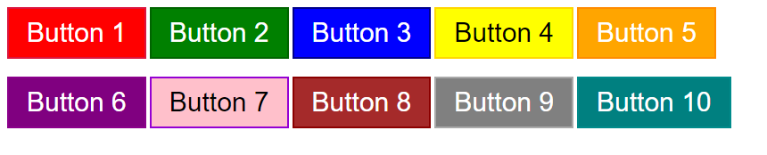

# Button Styles Showcase

This project demonstrates a collection of buttons with different styles and functionalities. Each button has a unique color and border style, and clicking on them triggers various actions.

## Preview

## Prerequisites

To view the project, you only need a modern web browser.

## Installation

1. Clone or download the project repository to your local machine.

2. Navigate to the project directory.

3. Open the `index.html` file in your web browser.

## Usage

Click on the buttons to see the different functionalities they showcase:

1. **Button 1**: Clicking this button will display an alert with the message "Button 1 was clicked!"

2. **Button 2**: Clicking this button will log the message "Button 2 was clicked!" to the browser console.

3. **Button 3**: Clicking this button will change its background color to red.

4. **Button 4**: Clicking this button will change the background color of the entire page to light blue.

5. **Button 5**: Clicking this button will reset the background color of the entire page to white.

6. **Button 6**: Clicking this button will redirect you to "https://www.example.com" in a new tab.

7. **Button 7**: Clicking this button will create a new button element with the text "New Button" and add it to the end of the page.

8. **Button 8**: Clicking this button will display an alert with the message "Button 8 does nothing!" (For demonstration purposes only).

9. **Button 9**: Clicking this button will log the text content of Button 9 to the browser console.

10. **Button 10**: Clicking this button will replace the entire content of the page with an `<h1>` element displaying the message "All buttons were clicked!"

## Customization

You can modify the styles of the buttons by editing the `style.css` file. Feel free to experiment with different colors, borders, and sizes to create your button styles.

## License

This project is licensed under the MIT License - see the [LICENSE](LICENSE) file for details.
