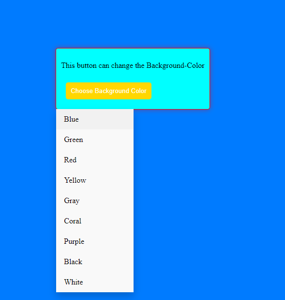

# Color Chooser Dropdown

This code snippet demonstrates a color chooser dropdown implemented using HTML, CSS, and JavaScript.

## Preview

## Usage

1. Copy the HTML code and paste it into your HTML file.
2. Create a CSS file (e.g., `style.css`) and copy the CSS code into it.
3. Link the CSS file in your HTML file using the `<link>` tag.
4. Create a JavaScript file (e.g., `script.js`) and copy the JavaScript code into it.
5. Link the JavaScript file at the bottom of your HTML file using the `<script>` tag.
6. Customize the content within the HTML elements to match your requirements.

## Features

- The dropdown provides color options that can be used to change the background color of an element.
- Clicking the dropdown button toggles the visibility of the color options.
- Selecting a color option updates the background color of the element.
- The JavaScript code includes a function to calculate the contrast color based on the selected background color.

Feel free to modify the code and styles to suit your specific requirements.

## License

This code is released under the [MIT License](LICENSE). Feel free to modify and use it according to your needs.