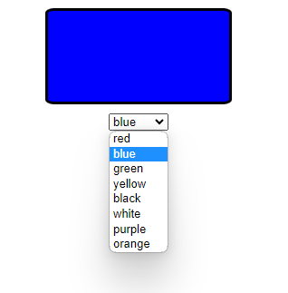

# Color Select and Change

This code provides a simple HTML, CSS, and JavaScript implementation for selecting and changing the background color of a `
` element based on the selected option from a `<select>` element.

## Preview

## Usage

To use this code, follow the instructions below:

1. Create an HTML file (e.g., `index.html`).
2. Create a CSS file (e.g., `styles.css`) and link it to the HTML file using the `<link>` tag.
3. Create a JavaScript file (e.g., `script.js`) and link it to the HTML file using the `<script>` tag.
4. Copy the HTML code and paste it into the HTML file.
5. Copy the CSS code and paste it into the CSS file.
6. Copy the JavaScript code and paste it into the JavaScript file.
7. Customize the styles, options, and functionality according to your preferences.

**Note:** Ensure that the file paths in the HTML file (`href="styles.css"`, `src="script.js"`) are correctly pointing to the CSS and JavaScript files.

## License

This code is released under the [MIT License](LICENSE). Feel free to modify and use it according to your needs.
