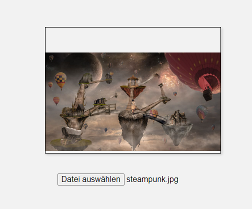

# Image Preview

This code demonstrates a simple image preview functionality. When a user selects an image file using the file input, the selected image is displayed in a preview container on the web page.

## Preview

## Usage

To use this code, follow the instructions below:

1. Create an HTML file (e.g., `index.html`).
2. Create a CSS file (e.g., `style.css`) and link it to the HTML file using the `<link>` tag.
3. Copy the HTML code and paste it into the HTML file.
4. Copy the CSS code and paste it into the CSS file.
5. Save the changes.
6. Open the HTML file in a web browser.

## How It Works

- The code includes an `` element with the ID `img` and a file input element with the ID `input`.
- The CSS styles define the appearance of the preview container and the file input.
- The JavaScript code adds an `onchange` event listener to the file input.
- When a file is selected, the code checks if a file is present.
- If a file is present, the code uses the `URL.createObjectURL()` method to generate a URL for the selected image file.
- The generated URL is assigned to the `src` attribute of the `img` element, which displays the selected image in the preview container.

Feel free to modify the code to suit your specific needs.

## License

This code is released under the [MIT License](LICENSE). Feel free to modify and use it according to your needs.
