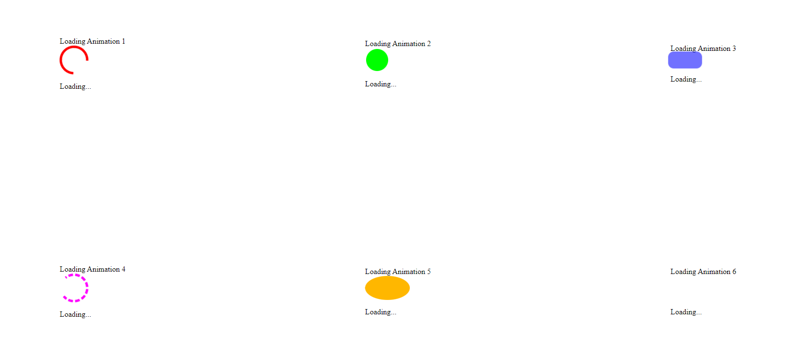

# Loading Animations

This project demonstrates various loading animations created using HTML and CSS. Each animation is displayed within a grid container, showcasing different styles and effects.

## Preview



## Usage

To use these loading animations in your HTML project, follow the instructions below:

1. Copy the HTML code from the provided `index.html` file into your own HTML file.
2. Link the `style.css` file in the head section of your HTML file using the following code:

   ```html
   <link rel="stylesheet" href="style.css">

3. Customize or modify the loading animations by editing the HTML and CSS code. You can add or remove loading boxes and modify their animation styles.


## Animation Styles

The project includes six loading animations, each with its own unique style and effect. The CSS code in the style.css file defines the animation keyframes and styles for each loading animation. Here's a brief description of each animation:

    - Loading Animation 1: A spinning circle with a red border.
    - Loading Animation 2: A bouncing circle with a green background.
    - Loading Animation 3: A pulsating rectangle with a blue background.
    - Loading Animation 4: A spinning dashed circle with a magenta border.
    - Loading Animation 5: A stretching circle with a yellow-to-orange gradient background.
    - Loading Animation 6: A blinking circle with a cyan background.

Feel free to customize the animations by modifying the CSS code in the style.css file. You can adjust the animation duration, colors, shapes, and other properties to match your design requirements.

## Dependencies

This project does not have any external dependencies. It only uses HTML and CSS to create the loading animations.

You can integrate these loading animations into your web applications, websites, or any project that requires visual feedback during loading or processing tasks.

Enjoy adding engaging loading animations to enhance the user experience of your applications!

## License

This code is released under the [MIT License](LICENSE). Feel free to modify and use it according to your needs.