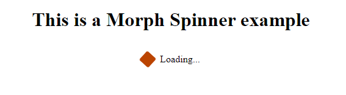

# Morph Spinner

This is a simple HTML and CSS code that creates a morph spinner. The spinner is a visual element that animates between two shapes and colors, creating a loading effect. It is commonly used to indicate that content is being loaded or processed.

## Preview

## Technologies Used

- HTML
- CSS

## Usage

1. Download the HTML and CSS files and save them in the same directory.
2. Open the HTML file in a web browser to view the morph spinner example.
3. Customize the content in the HTML file as needed.
4. Modify the CSS file to customize the styling of the spinner.
5. Optionally, tweak the animation properties in the CSS file to adjust the morphing effect.
6. Save your changes and refresh the web page to see the updated spinner.

## License

This code is released under the [MIT License](LICENSE). Feel free to modify and use it in your own projects.
