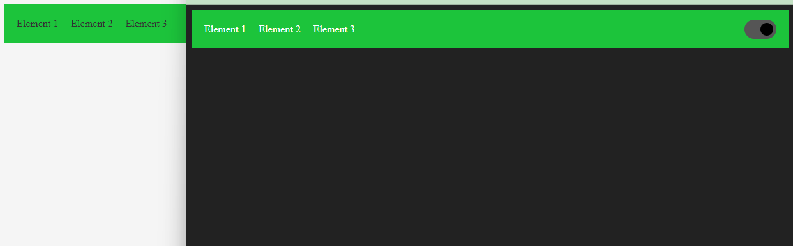

# Navbar with Dark Mode Switch

This is a simple HTML and CSS implementation of a navigation bar with a dark mode switch. It allows users to toggle between light and dark mode.

## Preview



## Usage

To use this navbar with a dark mode switch in your HTML project, follow the instructions below:

1. Copy the HTML code from the provided `index.html` file into your own HTML file.
2. Link the `style.css` file in the head section of your HTML file using the following code:

   ```html
   <link rel="stylesheet" href="style.css">

3. Copy the JavaScript code from the provided script.js file and include it in your HTML file before the closing </body> tag:

    ```html
    <script src="script.js"></script>

4. Customize or modify the navbar content, links, and dark mode styles by editing the HTML, CSS, and JavaScript code.

## Structure

The navbar is structured as follows:

- The navigation bar is contained within a <nav> element.
- The navigation links are displayed as an unordered list (<ul>) with list items (<li>). Each link is represented by an anchor (<a>) element.
- The dark mode switch is implemented using an HTML checkbox input (<input type="checkbox">) and a corresponding label element (<label>).

## Styling

The navbar is styled using the CSS code in the style.css file. Here are some key styles applied:

- The navigation bar has a green background color and is centered with space between the items.
- The list style of the unordered list is removed, and each list item has a margin to create spacing between the links.
- The links have no text decoration and a dark gray color.
- The dark mode functionality is implemented using JavaScript. When the switch toggle is checked, the dark-mode class is added to the body element, which triggers the corresponding dark mode styles defined in the CSS.

## Customization

Feel free to customize the styles, colors, and functionality of the navbar and dark mode switch to match your design preferences. You can modify the HTML, CSS, and JavaScript code accordingly.

## Dependencies

This project does not have any external dependencies. It only uses HTML, CSS, and JavaScript to create the navbar and implement the dark mode switch.

You can integrate this navbar into your web applications, websites, or any project that requires a responsive navigation bar with a dark mode feature.

Enjoy enhancing your website or application with this navbar implementation!

## License

This code is released under the [MIT License](LICENSE). Feel free to modify and use it according to your needs.