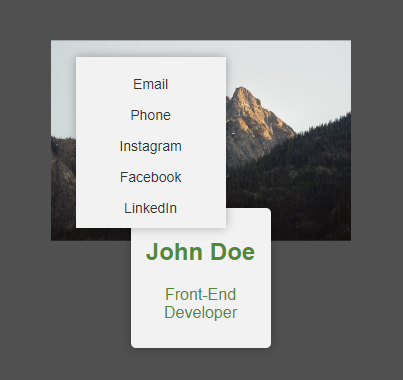

# Profile Card

This is a simple HTML and CSS code snippet that creates a profile card component. The profile card consists of a front side and a back side. When the user hovers over the front side of the card, the profile picture scales up and additional information is displayed. When the user hovers over the back side of the card, it slides into view to reveal a list of contact information.

## Preview

## Usage

To use this profile card component, follow these steps:

1. Download the `style.css` file and include it in your project.
2. Copy the HTML code snippet and paste it into your HTML file.
3. Customize the profile picture by replacing the `src` attribute of the `img` tag with the URL of your desired image.
4. Customize the name and job title by modifying the content within the `h2` and `p` tags.
5. Customize the contact information by adding or modifying the list items within the `ul` tag. Each list item should contain an anchor (`a`) tag with an icon (`i`) and a label.
6. Style the profile card further by modifying the CSS code to match your desired design.

## CSS Classes

- `.profile-card`: The main container for the profile card.
- `.front-card`: The container for the front side of the profile card.
- `.profile-pic`: The profile picture displayed on the front side.
- `.profile-info`: The container for additional information displayed on the front side.
- `.back-card`: The container for the back side of the profile card.
- `.back-card ul`: The list container for the contact information.
- `.back-card li`: The list items within the contact information list.
- `.back-card a`: The anchor tags within the list items.
- `.back-card i`: The icons within the anchor tags.

## Customization

You can customize the profile card by modifying the CSS properties in the `style.css` file. Here are some possible customizations:

- Adjust the background color of the profile card and the text color.
- Change the font family and font size.
- Modify the dimensions and positioning of the card and its elements.
- Customize the transitions and hover effects.

Feel free to experiment and make the profile card fit your design requirements.

## Credits

- Profile picture by [Unsplash](https://source.unsplash.com/random)
- Icons by [Font Awesome](https://fontawesome.com/)

## License

This code is released under the [MIT License](LICENSE). Feel free to use, modify, and distribute it as needed.
