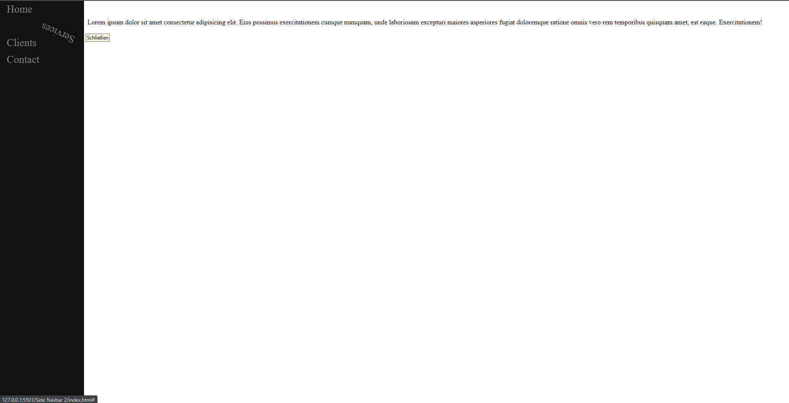

# Side Navbar 2

This project demonstrates a simple side navigation bar with a cool animation effect using HTML, CSS, and JavaScript.

## Preview

## Overview

The project consists of three files:

- `index.html`: This file contains the HTML structure of the side navigation bar and the main content area.

- `style.css`: This file contains the CSS styling for the side navigation bar, links, and the main content area.

- `script.js`: This file contains the JavaScript code that adds a cool animation effect to the links when hovered over.

## How to Use

To use the side navigation bar, follow these steps:

1. Clone the repository: `git clone `
2. Open `index.html` in your web browser.

## Styling Details

The CSS file `style.css` defines the following styling:

- The `.sidenav` class sets the style for the side navigation bar, including width, position, background color, and links' appearance.

- The `.sidenav a` class styles the links inside the side navigation bar, including padding, font size, and color.

- The `.main` class adds a left margin to the main content area to create space for the side navigation bar.

- The `.cool-effect` class defines a cool animation effect using keyframes for the links.

## JavaScript Interaction

The JavaScript file `script.js` adds interactivity to the side navigation bar:

- It selects all anchor elements inside the element with class "sidenav."

- For each link, it adds event listeners for the "mouseover" and "mouseout" events.

- When the mouse is over the link, it adds the class "cool-effect" to create a cool animation.

- When the mouse goes out of the link, it removes the class "cool-effect" to stop the animation.

## Contribution

- Contributions are welcome! Please feel free to fork the repository and submit a pull request.

## License

This code is released under the [MIT License](LICENSE). Feel free to use, modify, and distribute it as needed.
