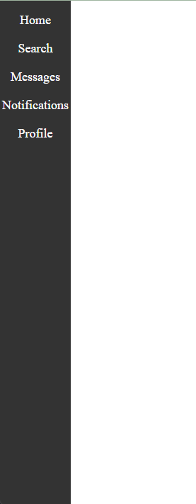

# Side Navbar

This project demonstrates a side navbar implementation using HTML, CSS, and JavaScript.

## Preview

## Usage

1. Create an HTML file and name it, for example, `index.html`.
2. Create a CSS file and name it, for example, `style.css`.
3. Create a JavaScript file and name it, for example, `script.js`.
4. Copy the provided HTML code into the `index.html` file.
5. Copy the provided CSS code into the `style.css` file.
6. Copy the provided JavaScript code into the `script.js` file.
7. Link the CSS file to the HTML file using the `<link>` tag.
8. Link the JavaScript file to the HTML file using the `<script>` tag.
9. Open the HTML file in a web browser.

## Features

- Displays a fixed side navigation bar on the left side of the page.
- The navigation bar contains links with icons.
- Clicking on a link adds an "active" class to the clicked link and removes the "active" class from other links.

## Dependencies

This project relies on the following dependencies:

- [Font Awesome](https://fontawesome.com/): Used for the icons in the navigation links.

Make sure to include the Font Awesome CSS file in your HTML file if you haven't already.

## License

This code is released under the [MIT License](LICENSE). Feel free to use, modify, and distribute it as needed.
