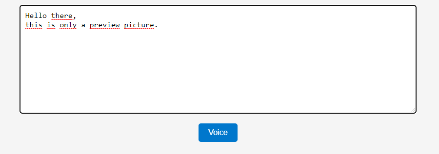

# Text to Speech

This project allows users to convert text into speech using the browser's Text-to-Speech functionality.

## Preview

## Usage

1. Create an HTML file and name it, for example, `index.html`.
2. Create a CSS file and name it, for example, `style.css`.
3. Create a JavaScript file and name it, for example, `index.js`.
4. Copy the provided HTML code into the `index.html` file.
5. Copy the provided CSS code into the `style.css` file.
6. Copy the provided JavaScript code into the `index.js` file.
7. Link the CSS file to the HTML file using the `<link>` tag.
8. Add the JavaScript file to the HTML file using the `<script>` tag.
9. Open the HTML file in a web browser.

## Features

- The user can enter text into a textarea input.
- The user can click a button to convert the entered text into speech.
- The entered text is converted into speech using the browser's Text-to-Speech functionality.

## Compatibility

This project uses the Web Speech API, which is supported by most modern web browsers. However, it's always a good practice to check the browser compatibility of the Web Speech API before deploying the project.

## License

This code is released under the [MIT License](LICENSE). Feel free to use, modify, and distribute it as needed.
