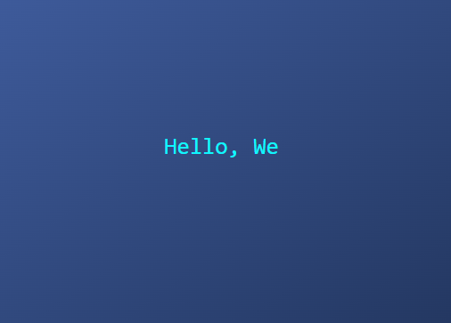

# Typed Text Effect

This project creates a typing animation effect where text appears as if it is being typed out on the screen.

## Preview

## Usage

1. Create an HTML file and name it, for example, `index.html`.
2. Create a CSS file and name it, for example, `style.css`.
3. Copy the provided HTML code into the `index.html` file.
4. Copy the provided CSS code into the `style.css` file.
5. Link the CSS file to the HTML file using the `<link>` tag.
6. Open the HTML file in a web browser.

## Features

- Displays a typing animation effect on the screen.
- The typing animation creates the illusion of text being typed out.
- The text can be customized by modifying the content within the `.typing` element.
- The background and text colors can be customized by modifying the corresponding CSS properties.

## Compatibility

This project uses modern CSS features and should be compatible with most modern web browsers. However, it's always a good practice to check the browser compatibility of the CSS features used before deploying the project.

## License

This code is released under the [MIT License](LICENSE). Feel free to use, modify, and distribute it as needed.
