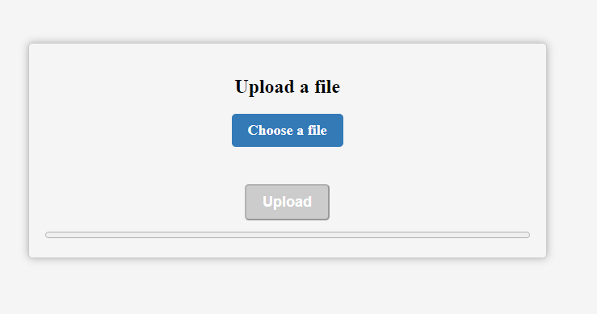

# Uploader

This is a simple HTML, CSS, and JavaScript code snippet that creates an uploader component. The uploader allows users to select a file and upload it to the server. It includes a file input field, a file name display, an upload button, and an upload progress bar.

## Preview

## Usage

To use this uploader component, follow these steps:

1. Download the `style.css` and `script.js` files and include them in your project.
2. Copy the HTML code snippet and paste it into your HTML file.
3. Customize the styles in the `style.css` file to match your design preferences.
4. Customize the upload functionality in the `script.js` file if needed.

## HTML Structure

The uploader component consists of the following HTML elements:

- `div#container`: The main container that centers the uploader vertically and horizontally.
- `div.uploader`: The uploader container that holds all the uploader elements.
- `h2`: Heading for the uploader component.
- `label.file-label`: Label for the file input field.
- `input.file-input`: File input field for selecting a file.
- `p#file-name`: Paragraph element to display the selected file name.
- `button.upload-button`: Button to initiate the file upload.
- `progress.upload-progress`: Progress bar to display the upload progress.

## CSS Classes

The uploader component uses the following CSS classes:

- `.uploader`: Styles the uploader container.
- `.file-label`: Styles the file input label.
- `.file-input`: Styles the file input field.
- `#file-name`: Styles the paragraph element for displaying the file name.
- `.upload-button`: Styles the upload button.
- `.upload-button:disabled`: Styles the disabled upload button.
- `.upload-progress`: Styles the upload progress bar.

Feel free to modify the CSS code in the `style.css` file to customize the appearance of the uploader component.

## JavaScript Functionality

The JavaScript code in `script.js` provides the following functionality:

- Updates the file name display when a file is selected.
- Enables/disables the upload button based on file selection.
- Tracks the upload progress and updates the progress bar accordingly.
- Sends the selected file to the server for uploading.

You can modify the JavaScript code in `script.js` to add additional functionality or customize the upload process as per your requirements.

## License

This code is released under the [MIT License](LICENSE). Feel free to use, modify, and distribute it as needed.
